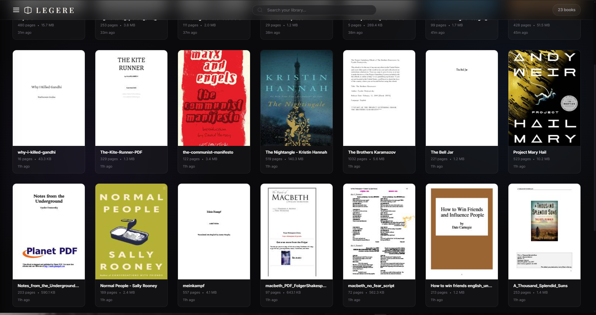
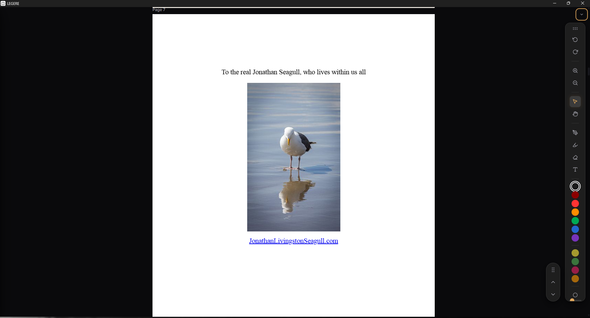
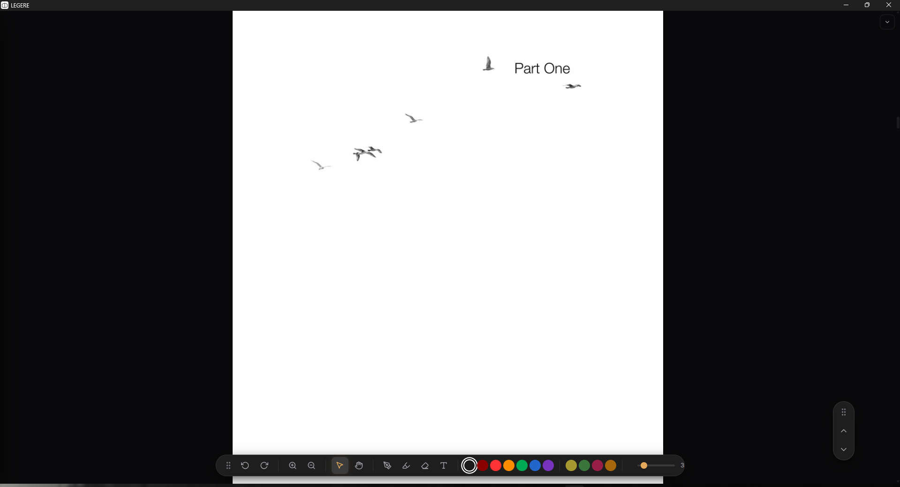

<p align="center">
  
</p>

# Legere - Modern PDF Reader

Being a avid reader on my 2 in 1, thre is a dearth of truly lightweight, no clutter, and absolutely local storage based and no cloud fluff readers, While folks with IPads get to have their own fancy ass apps to read , we are stuck with 3rd grade readers , or god forbid Adobe Acrobat at best. Legere is something I made for myself, and I guess you might happen to like it too, to just read books on your laptop or 2in1. Feel free to contribute or reach out for any queries. Some of the technical details are entailed below.

## Screenshots

<p align="center">
  
  <br/>
  <i>Clean, clutter-free library management</i>
</p>

<p align="center">
  
  <br/>
  <i>Reading view with vertical annotation and scroll docks</i>
</p>

<p align="center">
  
  <br/>
  <i>Reading view with horizontal dock auto-alignment</i>
</p>

## Architecture

This application is engineered with a strict focus on maximizing performance and minimizing resource consumption, ensuring it does not hog your precious RAM. It leverages the following core technologies:

- **Tauri & Rust:** Powers the native desktop window and file system interactions. Unlike Electron, Tauri uses the OS's native webview (WebView2 on Windows), resulting in a tiny app bundle size and a minimal RAM/CPU footprint.
- **Vanilla JavaScript & CSS:** The frontend is entirely devoid of heavy UI frameworks like React or Angular. This ensures lightning-fast load times, zero Virtual DOM overhead, and direct, highly efficient DOM manipulation.
- **Vite:** Serves as the modern frontend build tool, providing instant Hot Module Replacement (HMR) during development and highly optimized, minified bundles for production.
- **PDF.js (Mozilla):** The industry-standard core engine used for parsing and rendering PDF documents.
- **Fabric.js:** An HTML5 canvas library layered perfectly on top of the rendered PDF pages to handle high-performance vector-based annotations (drawing, highlighting, text).
- **IndexedDB:** A robust client-side storage API used to maintain the book library metadata, thumbnails, and state, ensuring instant startup.

## Technical Jargon

### Lazy Page Rendering
To ensure the app remains ultra-responsive even when loading 1,000+ page textbooks, the PDF rendering engine utilizes an `IntersectionObserver`. Pages are strictly rendered onto the GPU canvas *only* when they are actively scrolled into the viewport. This keeps memory consumption completely flat regardless of document length.

### Debounced Background Saving
Annotations are automatically saved, but to prevent hard drive thrashing, all draw events are batched and debounced. The data is cleanly serialized into JSON and saved alongside the PDF file automatically in the background.

### Hardware-Accelerated Smooth Scrolling
The custom floating scroll dock bypasses native jumpy scroll events by utilizing a `requestAnimationFrame` loop. This delegates the scrolling math directly to the display's native refresh rate, resulting in a buttery-smooth panning experience without jitter.

## Getting Started

### Prerequisites
- [Node.js](https://nodejs.org/)
- [Rust & Cargo](https://rustup.rs/) (Required for compiling the native Tauri backend)

### Installation & Build

1. **Install JavaScript dependencies:**
   ```bash
   npm install
   ```

2. **Run the development server:**
   ```bash
   npm run tauri dev
   ```

3. **Build the final Windows Installer executable:**
   ```bash
   npm run tauri build
   ```
   *The final MSI installer will be located in `src-tauri/target/release/bundle/msi/`.*

## License

This project is licensed under the MIT License - see the [LICENSE](LICENSE) file for details.


### PS 
Someone help me to focus on placements, DSA and all that boring stuff instead of making these random ass apps...